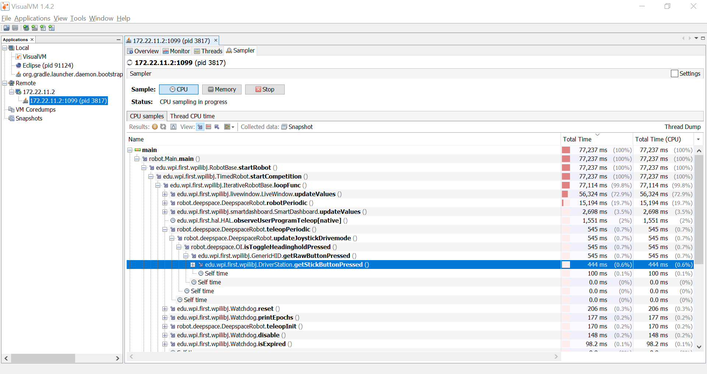

2393 First
==========


Setup for the 2019 Season
-------------------------

For full details see 
https://www.firstinspires.org/resource-library/frc/competition-manual-qa-system and 
http://wpilib.screenstepslive.com/s/4485

In short, you need the following which you can get from the mentioned web links
or from the USB available in the software meetups:

 * Git from https://git-scm.com/downloads
 * WPILibInstaller.zip from https://github.com/wpilibsuite/allwpilib/releases
   Select to install for the current user.
   In the first dialog, select to download VS Code unless you have the OfflineVsCodeFiles.zip.
   Select all but "C++ Compiler".

As a result, you should have FRC desktop icons for VS Code,
SmartDashboard etc.

Open VS Studio, invoke View, Command Palette, and type "Git: Clone".
Enter this URL: `https://github.com/Team2393/FRC`
Create & browse to a folder `git` in your home directory.

The above setup gives you the Java Development tools, which are free and usually
quick to install.
To deploy code onto the RoboRIO, you also need the National Instruments' Drive Station,
which takes longer to install and requires a password.
Details are avaialble in the software meetups.

WPILib
------

We're using Java and WPILib,
the robotics library started at Worcester Polytechnic Institute (WPI)
that is used for controlling FIRST robots.
It's an open-source project on GitHub where anybody can
make suggestions and contributions,
see https://github.com/wpilibsuite/allwpilib/issues/954

In addition, we use the CTR Phoenix API to communicate
with CAN devices, see separate CAN.md 


Git Clone & Open in VS Code
---------------------------

If you already had a git clone of this repo from previous Eclipse-based work,
go there in a git bash, type `git pull` to get the latest,
then use File, Open Folder in VS Code to open.

If you do not have a git clone, open VS Studio,
invoke View, Command Palette, and type "Git: Clone".
Enter this URL: `https://github.com/Team2393/FRC`
Create & browse to a folder `git` in your home directory.

Git Update
----------

To later get an update, i.e. to fetch the latest,
invoke View, Command Palette, and type "Git: Pull".
You can also use View, SCM, and then invoke "Pull"
from the "..." menu.

Creating a Git Branch
---------------------
To create a branch, click on the branch name in the 
lower left corner. Select Create new branch from the
dropdown, then enter a name.

Github has a section that shows all branches:
https://github.com/Team2393/FRC/network

Committing Changes
------------------
Go to View > SCM. This will show what has changed.
You can double click on one of the listed files to
see what has changed. On the right side of the file name
there are three icons.
1) paper with arrow-> just reopens the file
2) curved arrow-> will remove the changes 
3) plus sign-> stages the changes for a commit
Once all changes are staged, you can commit them
with a message by clicking the check button on top.
You can then push them to GitHub by clicking the
3 dots on top and selecting "Push" from the
dropdown.

Merging and Syncing
-------------------
If a branch contains useful changes, we can go to the
github page and make a pull request. You should 
periodically press the sync button to ensure you have the
latest changes. Before starting new work, go to the 
master branch, sync, and  then create a new branch for your
work.


Running
-------

Code in the `first` and `bank` packages can run by opening those
files that contain a `main()` method and pushing the "Run" button
that will appear above the `main()` method.
When running code that reads from `System.in` you might notice that
the code runs in the internal console which doesn't permit keyboard input.
Locate the launch configuration in the file `.vscode/launch.json`.
Add a line
```
"console": "integratedTerminal",
```
and now the code will run in a terminal that allows keyboard input.

For anything in `robot` you need the WPILib. That way you can view and edit the code.
To compile, invoke "Build Robot Code" from the upper right "..." menu.
To actually run it, you deploy to the roboRIO hardware via "Deploy Robot Code"
in the same menu.


Profiling
---------



'VisualVM', available from https://visualvm.github.io,
allows you to see how much CPU and memory the code is using on the RoboRIO,
and where it spends its time.

To profile a program running on the laptop, simply double-click it in the 'Local' list.
To profile a program that is running on the RoboRIO,
we need to enable 'Remote JMX' access to that program.

Open a "git bash" shell, connect to the robot via
```
# Use 10.23.93.2 when using radio, otherwise the 'USB' IP address
ssh lvuser@172.22.11.2
```

If `ssh` issues "WARNING: REMOTE HOST IDENTIFICATION HAS CHANGED!"
because you had used it with a different RoboRIO:
```
rm .ssh/known_hosts
ssh lvuser@172.22.11.2
```

Edit the file `robotCommand`. By default it will look like this:
```
/usr/local/frc/JRE/bin/java -Djava.library.path=/usr/local/frc/third-party/lib   -jar "/home/lvuser/2393First.jar"
```

Add these settings:
```
-Dcom.sun.management.jmxremote=true -Dcom.sun.management.jmxremote.port=1099 -Dcom.sun.management.jmxremote.local.only=false -Dcom.sun.management.jmxremote.ssl=false -Dcom.sun.management.jmxremote.authenticate=false -Djava.rmi.server.hostname=10.23.93.2 
```

The settings need to be added after the `.../bin/java`, and use the correct IP for the `hostname` setting.
To do that with `vi`:
```
vi robotCommand
# Move cursor to the end of .../bin/java
# Press 'i' for insert
# Paste the text for the added settings
# Press `ESC` to exit insert mode
# Type ':wq' and press 'Enter' to write and quit
```

Stop the running Java instance:
```
/usr/local/frc/bin/frcKillRobot.sh
```

After a few seconds you should see that a new one is automatically started, this time using the additional JMX settings:
```
ps | grep java
```

Back on the laptop, start `visualvm` and connect to the program running on the robot.
 * File, Add JMX Connection
 * 'Connection:' 172.22.11.2:1099 (respectively 10.23.93.2:1099)
 * Check 'Do not require SSL connection'
 * A new entry with a 'pid' should appear under the 'Remote' list.
   Double-click, then check 'Monitor', 'Sample.. CPU' etc.

