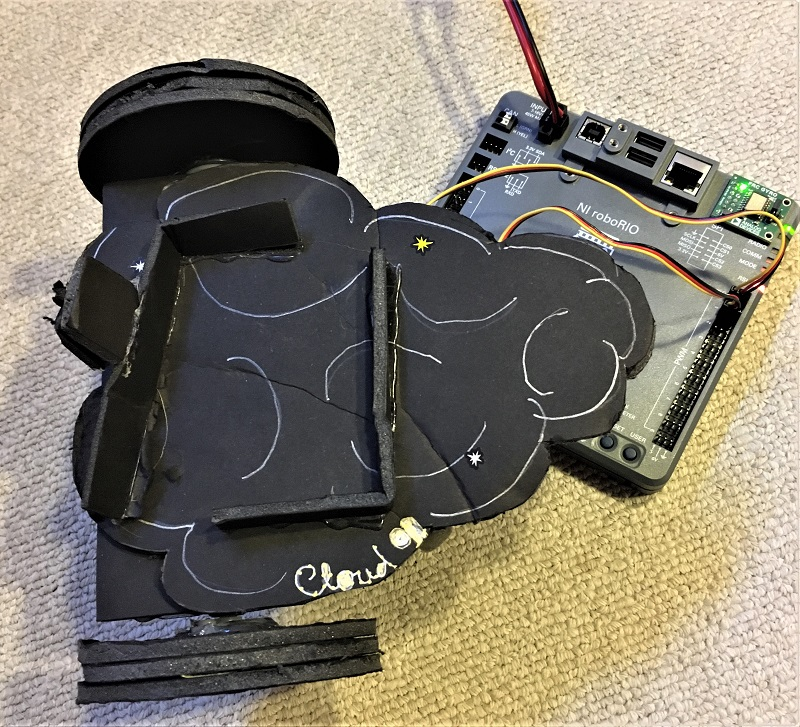

2393 First
==========

Git Clone
---------

Import into Eclipse:
 * Menu File
 * Import
 * Git
 * Projects from Git
 * Clone URI
 * Enter `https://github.com/kasemir/2393First`
 * Next, Next, ..., Finish
 
--> Now you have a "2393First" project in your Eclipse workspace.

Git Update
----------

To later get an update, i.e. to fetch the latest:
 * Right-click on the "2393First" project
 * Team
 * "Pull" (there's a similar option "Pull..", don't use that. Use the one just named "Pull")

Install WPILib
--------------

To work with the robot code, you need to install the WPIlib.

You can try this directly from the web:

 * In Eclipse, "Help", "Install new software", and then enter
   "http://first.wpi.edu/FRC/roborio/release/eclipse"

Alternatively, use a EclipsePluginsV2018.4.1.zip that you get
from a USB stick during a meetup or download from
http://first.wpi.edu/FRC/roborio/release/EclipsePluginsV2018.4.1.zip.

 * In the Windows File Explorer, unpack/extract the downloaded `EclipsePluginsV2018.4.1.zip`
 * In Eclipse, "Help", "Install new software", press "Add", "Local",
   and select the `eclipse` directory inside the extracted `EclipsePluginsV2018.4.1`.

Either way, you then continue like this:

 * Click the drop-down arrow near "WPILib Robot Development" to expand, then select "Robot _Java(!)_ Development".
 * Press Next, Accept, ..., Finish
 * You'll see "Installing Software" in the bottom right corner.
 * When prompted to restart Eclipse, do that.

WPILib is the robotics library started at Worcester Polytechnic Institute (WPI)
that is used for controlling FIRST robots.
It's an open-source project on GitHub where anybody can
make suggestions and contributions,
see https://github.com/wpilibsuite/allwpilib/issues/954

Running
-------

Code in the `first` and `bank` packages can run via 'Run As', 'Java Application'.

For anything in `robot` you need the WPILib. That way you can view and edit the code.
To actually run it, you'll need the roboRIO hardware which we'll have in the meetings.

Eclipse Editor Tweaks
---------------------

 * Menu Window, Preferences, Java, Code Style, Formatter, Import
 * Select YourHomeDir, git, 2393First, Formatter.xml

 * Menu Window, Preferences, Java, Editor, Save Actions:
 * [x] Perform the selection actions on save,
 * [x] Organize imports
 * [x] Additional Actions, 'Configure':
     * Code Organizing: Remove training whitespace
     * Unnecessary Code: Remove unused imports

